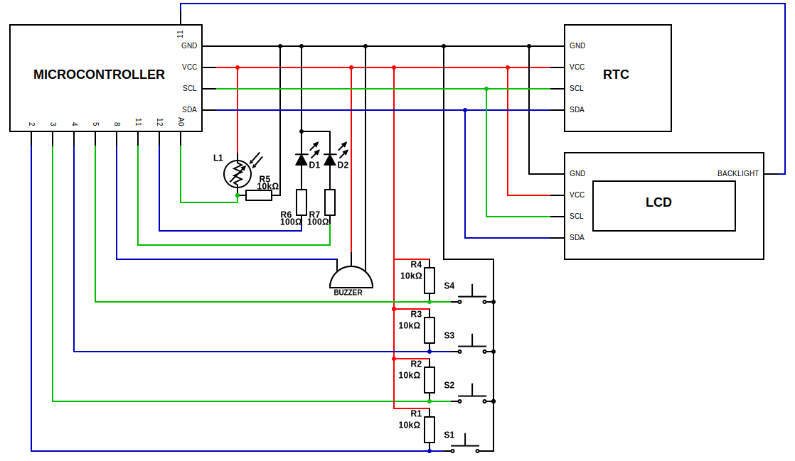
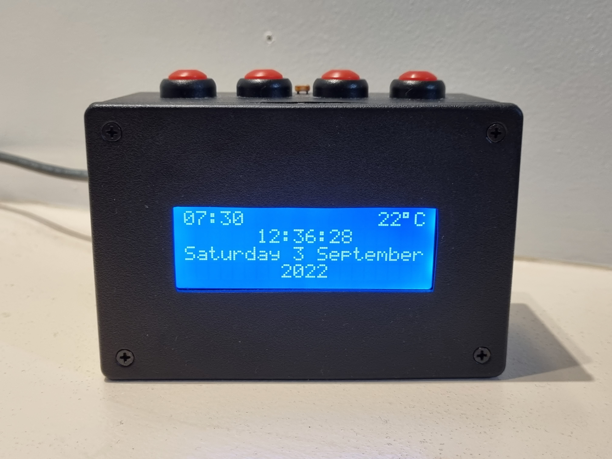
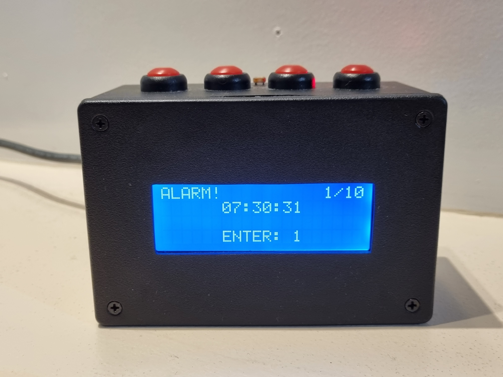
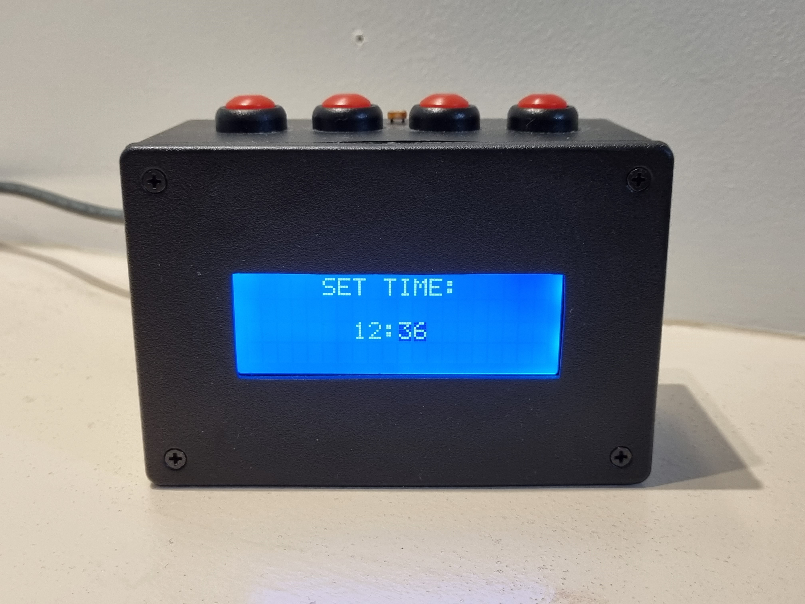
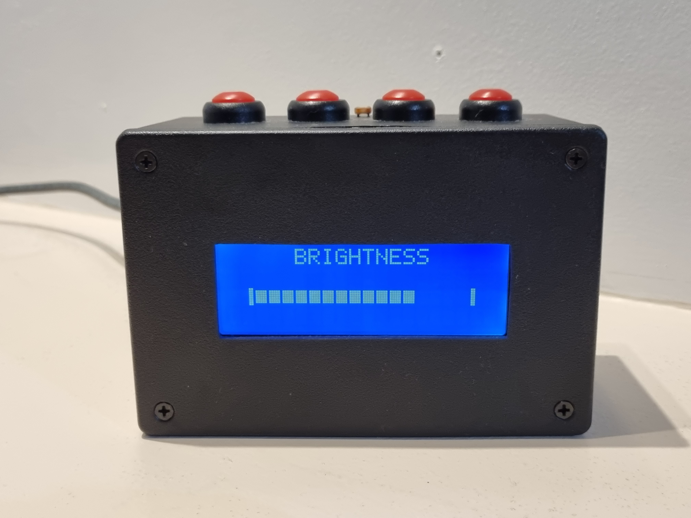
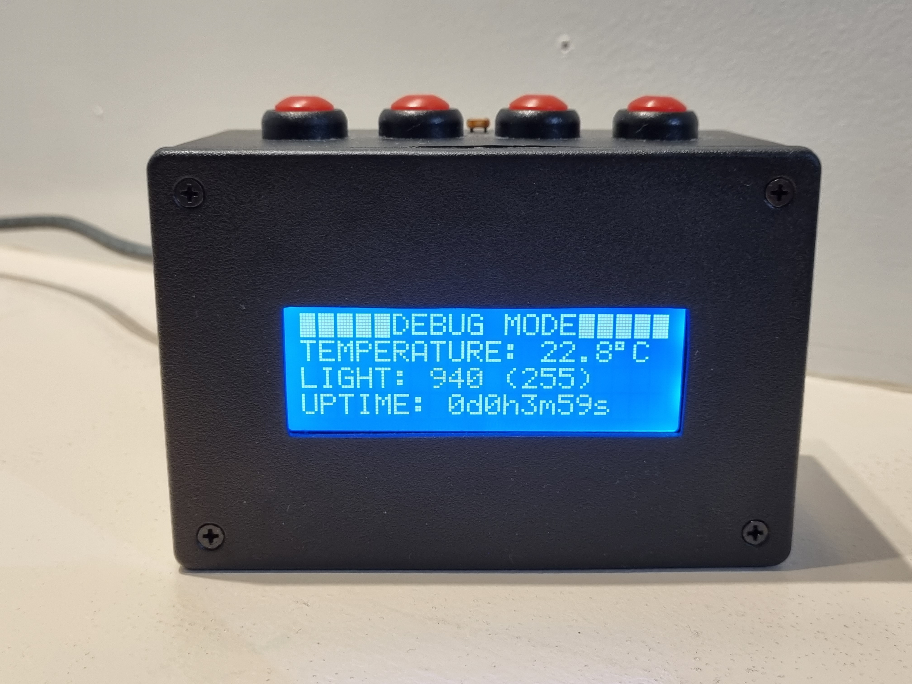

# TERALARM

A unique and effective alarm clock built on the Arduino platform.

Designed to guarantee the user is alert and awake, TERALARM is no ordinary alarm clock. Paired with a loud buzzer and on screen instructions providing a sequence of buttons which need to be pushed in order to disable the alarm, all risk of sleeping in is effectively eliminated. The user friendly design features only four buttons, each of which serves many functions depending on the current mode. The time is always accurate, even when switched off thanks to the hardware real time clock which also provides a precise temperature reading, visible from the clockface. Using a light intensity sensor, the system will automatically adjust the LCD's brightness to ensure the screen is always visible during the day while maintaining a comfortable light level at night.

## Features
### Detailed clockface
A 24 hour clock (including seconds), a full worded date string, the time the alarm is set for and the temperature are available at a glance on the clockface.
### User friendly setup
The time, date and alarm settings can be selected at the push of a few buttons and individual components such as hours, minutes, days, etc. can be incremented and decremented until the user is happy with their choice using the well designed on screen interface.
### Manual and automatic brightness
The brightness of the LCD can be finely set by the user using the up and down buttons or automatic brightness can be enabled which uses the built in light intensity sensor to automatically to adapt to the environment.
### Debug mode
Every sensor and internal value is made available to the user via debug mode. The exact readings from the temperature and light sensors, as well as uptime and data from the RTC and EEPROM are shown on the LCD in a easy to read form.
### Settings stored on device
Even when the power is lost to the system, your time and alarm settings will remain saved using the microcontroller's EEPROM and the battery powered real time clock (RTC).
### Effective alarm
Where most alarm clocks can be disabled using a single button press, TERALARM promotes a much more involved procedure. This is its defining feature, avoiding muscle memory and requiring the user to be awake (preventing oversleeping). The system generates random numbers between 1 and 4 and instructs the user to press the corresponding button. Each correct press adds a point to the users score and each incorrect deducts a point. Once the score reaches the challenge value set by the user, the alarm is disabled. The challenge can also be set to 'None' where the system functions as a regular alarm clock, with any button disabling the alarm.
### Snooze mode
During alarm setup, users can optionally set a snooze period of their choosing which can be configured with minute and second precision, up to a maximum of an hour. When enabled, the alarm will snooze for the specified time after being disabled initially, while counting down and displaying an on-screen progress bar. Once the snooze period has elapsed, the buzzer will sound briefly every 5 seconds until the snooze alert is dismissed by pushing a button.
### Mulitsensory feedback
Equipped with a buzzer and a pair of red/blue LEDs, user feedback is provided via sound and light. A different colour will flash and a different sound will play when the user confirms or cancels a setting. Both LEDs and the buzzer are also used when the alarm triggers.
### Bonus countdown timer
A 100 second countdown timer is included as an additional feature which can be accessed by holding down all buttons during startup. Makes use of a red flashing LED and buzzer sounds played at an increasing rate.
### Specifically designed algorithms
Algorithms such as a button press handler/debouncer and the reciprocal brightness function have been written from scratch to use the hardware to its full potential.

## How to use
### Setting the time/date
1. With the clockface showing, press button 1 to enter time setup.
2. The time/date setup screens progress as shown:
`[TIME] -> [DATE] -> [WEEKDAY]`
3. Use the up (button 3) and down (button 4) buttons to increment or decrement the current value (hour).
4. The currently editing value wraps, so increasing the hour past 23 gives 00 and vice versa.
5. Press confirm (button 1) to move across and edit the value to the right (minute).
6. Use the up and down buttons again to alter the value.
7. Press confirm once again to save the time and edit the date.
8. Use the same buttons as above for altering the date.
9. Press confirm to save the date and edit the weekday.
10. Use the same buttons as above for altering the weekday.
11. Press confirm to save the weekday and return to the clockface.
12. Press cancel (button 2) at any point during setup to discard the shown values and return to the clockface.

### Setting the alarm
1. With the clockface showing, press button 2 to enter alarm setup.
2. The alarm setup screens progress as shown:
`[ALARM TIME] -> [CHALLENGE] -> [SNOOZE TIME] -> [STATE]`
3. Use the up (button 3) and down (button 4) buttons to increment or decrement the current value (hour).
4. The currently editing value wraps, so increasing the hour past 23 gives 00 and vice versa.
5. Press confirm (button 1) to move across and edit the value to the right (minute).
6. Use the up and down buttons again to alter the value.
7. Press confirm once again to save the alarm time and edit the challenge.
8. Use the same buttons as above for altering the challenge.
9. Press confirm to save the challenge and edit the snooze time.
10. Use the same buttons as above for altering the snooze time. To disable snoozing, set a value of 00:00 and observe that this is displayed as NONE.
11. Press confirm to save the snooze time and edit the state.
12. Use the same buttons as above for altering the state.
13. Press confirm to save the state and return to the clockface.
14. Press cancel (button 2) at any point during setup to discard the shown values and return to the clockface.

### Changing the brightness
1. The brightness wraps, so increasing from automatic turns off the backlight where decreasing from off sets to automatic. Refer to the diagram:
`[OFF] -> 6% -> 12% -> ... -> 94% -> [MAX] -> [AUTO]`
2. With the clockface or brightness UI showing, press the up (button 3) button to increase the brightness and temporarily show the brightness UI.
3. With the clockface or brightness UI showing, press the down (button 4) button to decrease the brightness and temporarily show the brightness UI.

### Disabling the alarm
1. Provided the alarm state is set to on, when then time reaches the chosen alarm time, the alarm will sound.
2. When the challenge is set to none, press any button to disable the alarm and return to the clockface or begin snoozing.
3. When a challenge is set, press the button which corresponds with the instruction shown on the LCD.
4. Pressing the correct button will increase your score, where pressing the incorrect button will decrease it.
5. When the score meets the set challenge value, the alarm is disabled and if snooze is configured, the countdown for the set time begins. Otherwise, snoozing is skipped and the clockface is returned to.
6. Snoozing can be skipped during the countdown by pressing all four buttons simultaneously to return to the clockface immediately.
7. Once the configured snooze time has elapsed, the audible and visual alert will be given until dismissed.
8. Press any of the four buttons to dismiss the alert and return to the clockface.

### Entering debug mode
1. Alter the brightness by pressing either the up (button 3) or down (button 4) buttons while the clockface or brightness UI is showing.
2. While the brightness UI is showing, hold down buttons 1 and 2 until the debug mode is displayed.

### Muting the startup sound
1. While the system is starting up, hold down any of the buttons until both LEDs flash. The startup sound will not play.

### Entering the countdown
1. While the system is starting up, hold down all four buttons before the title is fully shown on the LCD.
2. Continue holding until the system prompts you to press any button to start the countdown.

## Required Libraries
* [**LiquidCrystal I2C**](https://www.arduino.cc/reference/en/libraries/liquidcrystal-i2c/) - Library to interface with the LCD
* [**DS3231**](http://www.rinkydinkelectronics.com/library.php?id=73) - Library to interface with the Real Time Clock (RTC)

## Hardware Schematic

## Photos

